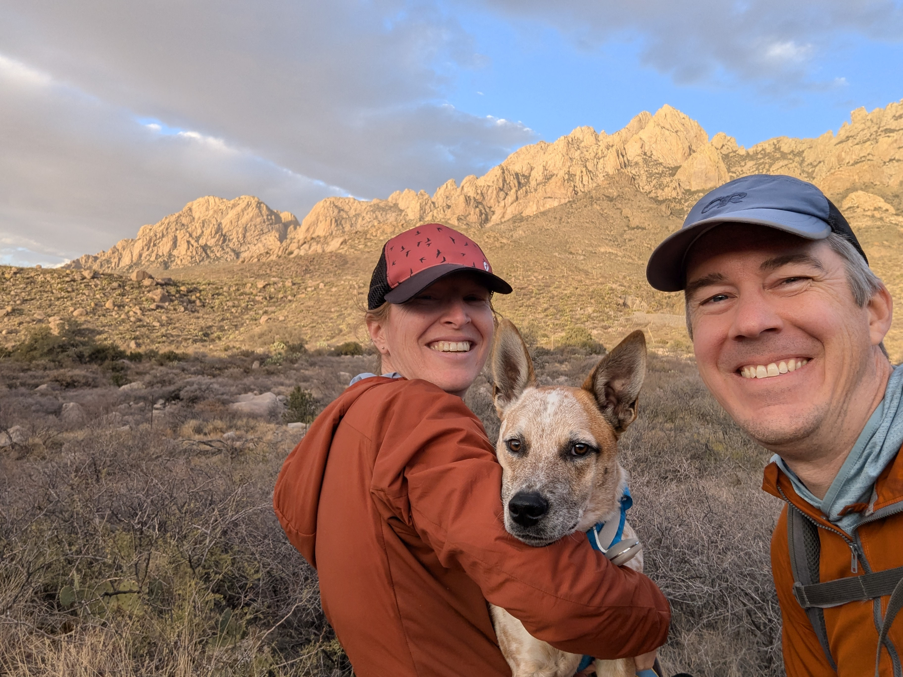

```{r setup, include=FALSE}
knitr::opts_chunk$set(echo = FALSE)
```

I have found myself increasing frustrated with my relationship with products like Facebook and Instagram. As a millennial, I grew up without any form of social media or cell phones until some point in high school. Now, I wake up every morning with my phone in hand. With the two-factor authentication required for so many websites and products that I use as well as the convenience of always having a smartphone camera in my pocket, I recognize that it will be nearly impossible to get rid of my smartphone at this point. Through the creation of this website though, I hope to deactivate most of my social media accounts to spend less time doomscrolling and more time living. Will I miss seeing frequent photos and personal updates from my friends and family? You betcha! I hope you won't mind staying in touch with phone calls, texts, emails, or visits to Las Cruces! And so begins this journey... 

```{r, eval=TRUE, echo=FALSE}
#| fig.cap: > 
#|    Christmas Day 2024 hike along the base of the Organ Mountains.
#| fig.alt: > 
#|    Theresa Laverty, John Field, and their dog Bruce on a hike in front of the Organ
#|    Mountains near sunset on Christmas Day 2024.

```
