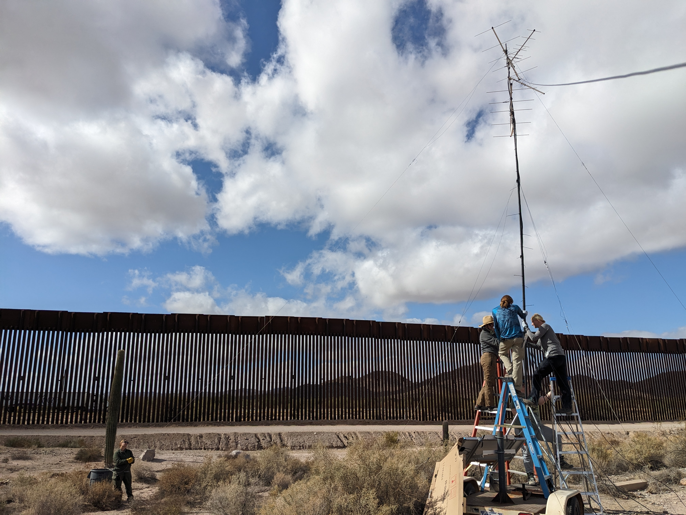
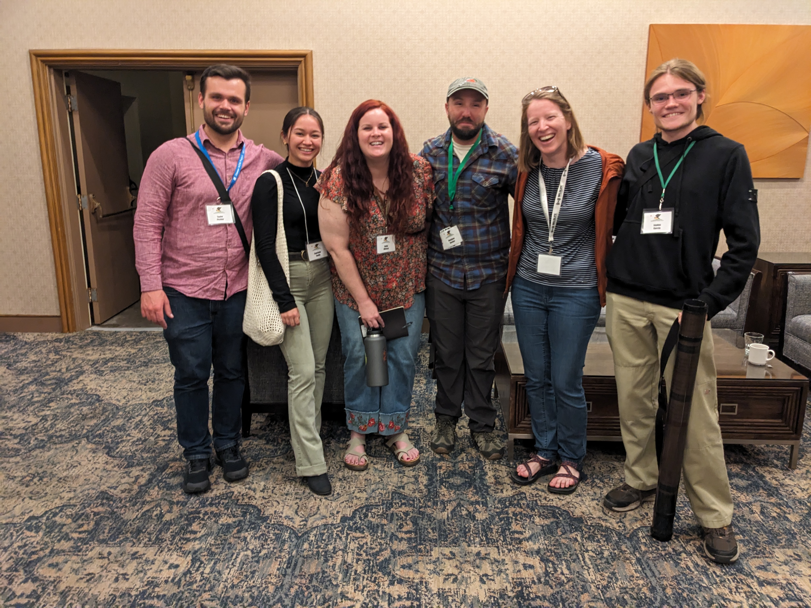
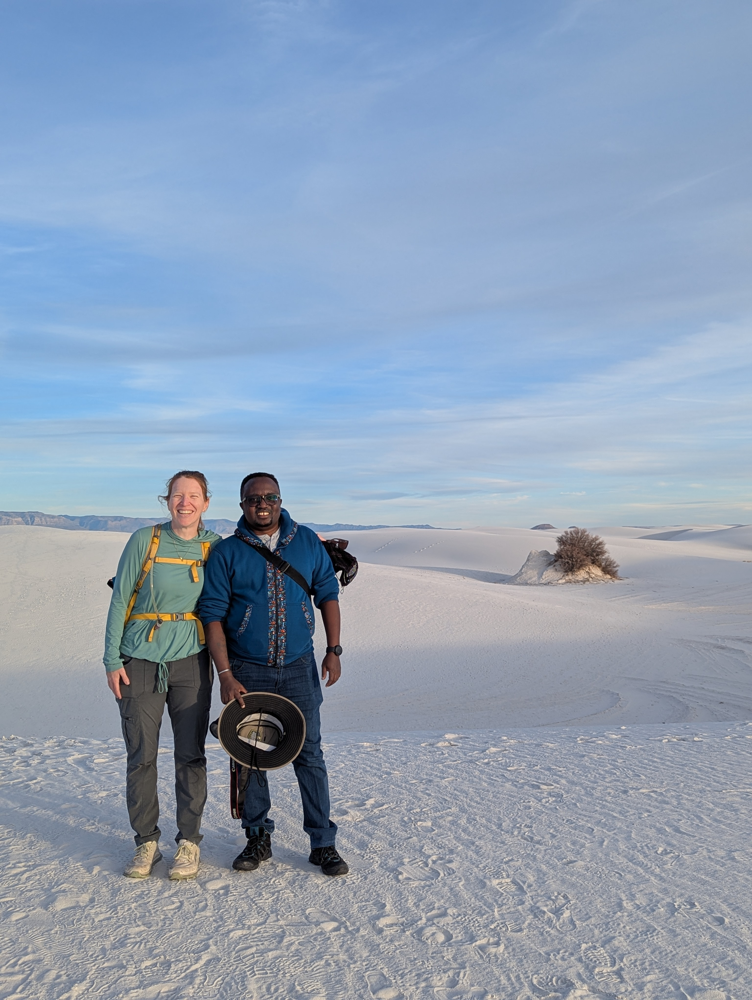
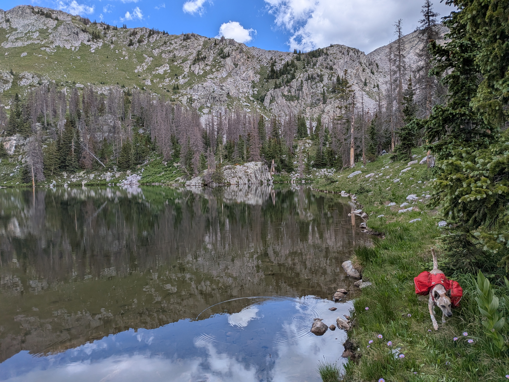
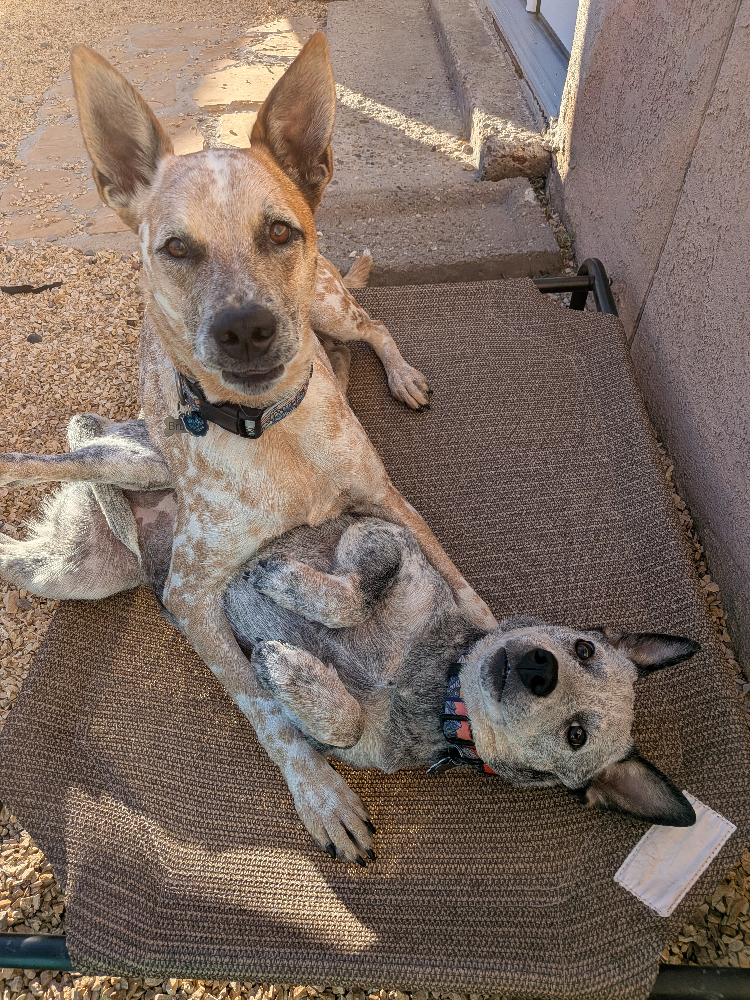
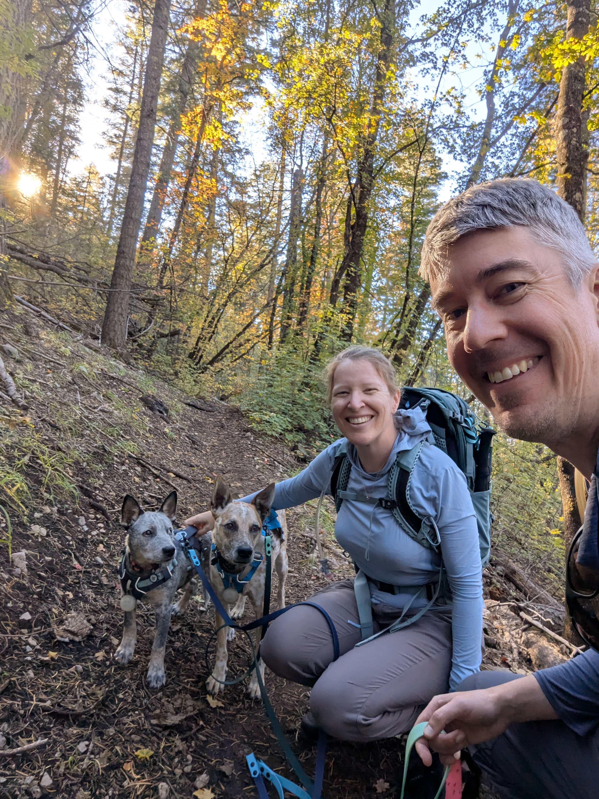

```{r setup, include=FALSE}
knitr::opts_chunk$set(echo = FALSE)
```

Well the start of another spring semester is around the corner, which means I am very behind on updates here. This year had a lot of smaller high points to it. After wrapping up spring semester of 2025, I now have taught each of my courses at least once, which opens up my schedule at least a little bit. I'll be teaching Natural History of the Vertebrates for the third time this spring and Mammalogy for the second time. This summer involved a bunch of trips to the field -- training undergraduate students to handle bats in AZ and NM, setting up a [Motus bat tracking study](https://motus.org/) in [Organ Pipe Cactus National Monument (ORPI)](https://www.nps.gov/orpi/index.htm), attending a bat acoustic course in Tucson, hosting colleagues from Mexico in ORPI and visiting their field site in [El Pinacate y Gran Desierto de Altar Biosphere Reserve](https://whc.unesco.org/en/list/1410/), and spending a chunk of time out at the [Jornada Basin Long-Term Ecological Research (LTER) site](https://lter.jornada.nmsu.edu/). Most of the lab road-tripped to San Diego in April for the Western Bat Working Group meeting. John and I also attended the Ecological Society of America meeting together (a first!) in August and an LTER principal investigator meeting in Santa Barbara in September. I just got back from a week in the field with a new student installing bat detectors for an exciting new tinaja (ephemeral pools found on bedrock) project in southern Arizona. To wrap up the work updates, I hired new students (including my first Ph.D. students) and saw my first M.S. student defend (successfully!) in the fall. Oh, I also hosted some wonderful friends/colleagues for seminar: David Kimiti, Michael Bogan, and Jeff Foster.

```{r, eval=TRUE, echo=FALSE}
#| fig.cap: > 
#|    Constructing a Motus tower along the U.S.-Mexico border.
#| fig.alt: > 
#|    Students raise a mast with antennas with the border wall in the background.

```
```{r, eval=TRUE, echo=FALSE}
#| fig.cap: > 
#|    Theresa with NMSU graduate and undergraduate students at the Western Bat Working Group meeting.
#| fig.alt: > 
#|    Theresa with NMSU graduate and undergraduate students after a poster session at the Western Bat Working Group meeting.

```
```{r, eval=TRUE, echo=FALSE}
#| fig.cap: > 
#|    Theresa and David Kimiti smile near the end of a hike on the Alkali Flat Trail in White Sands National Park.
#| fig.alt: > 
#|    Theresa and David Kimiti smile near the end of a hike on the Alkali Flat Trail in White Sands National Park.

```

In addition to all of that work travel, we took Bruce on his first backpacking trip on the Santa Barbara Divide (between Santa Fe and Taos) in July. He did an awesome job hauling his food and water for about 30 miles of trail. I celebrated my mom's birthday with her and some of my family in NJ in August. We saw Nathaniel Rateliff & the Night Sweats perform in Taos. We hosted John's family for the week of Thanksgiving and had his Durango friends, Evan and Michelle, over for dinner for an evening as they passed through town. Earlier in the year (February), John snuck out for a Whistler ski trip with friends. We purchased gravel bikes in Tucson. We enjoyed the monsoon season in Las Cruces after a spring full of dust storms. We hiked a lot within a two-hour radius of here, including a hike over Baylor Pass in the Organ's for our first wedding anniversary. We also finally explored some new parks together for John's birthday in December ([Guadalupe Mountains National Park](https://www.nps.gov/gumo/index.htm) and [Carlsbad Caverns National Park](https://www.nps.gov/cave/index.htm)). 

```{r, eval=TRUE, echo=FALSE}
#| fig.cap: > 
#|    Bruce alongside Truchas Lakes up the Santa Barbara Divide.
#| fig.alt: > 
#|    Bruce walks alongside Truchas Lakes up the Santa Barbara Divide with peaks in the background.

```

At the very end of September, we also brought home another cattle dog-mix puppy from the humane society in town and welcomed Zoe into our lives. Bruce now has a constant little sassy sidekick who always wants to be at his side. They really seem to enjoy each other's company, making it worth the extra work of training another puppy. Bruce passed his canine good citizen class this year, but I'm not so sure about Zoe. Two active dogs under two keeps us busy-- Bruce is beginning his fourth agility class later this week and we're excited to see if Zoe also enjoys it (a first for her). The two of them have been a very welcome distraction from our computers. 

```{r, eval=TRUE, echo=FALSE}
#| fig.cap: > 
#|    Bruce and Zoe up to no good.
#| fig.alt: > 
#|    Photo of Theresa and John's two cattle dog mixes: Bruce laying on top of Zoe.

```

Please reach out if you're ever in the Southwest. We have a guest bedroom! And stay tuned here for more updates in the (hopefully not so far) future.  

```{r, eval=TRUE, echo=FALSE}
#| fig.cap: > 
#|    Fall 2025 hike outside of Cloudcroft, New Mexico.
#| fig.alt: > 
#|    Theresa Laverty, John Field, and their dogs, Bruce and Zoe, on a hike in the Sacramento Mountains in the fall.

```
